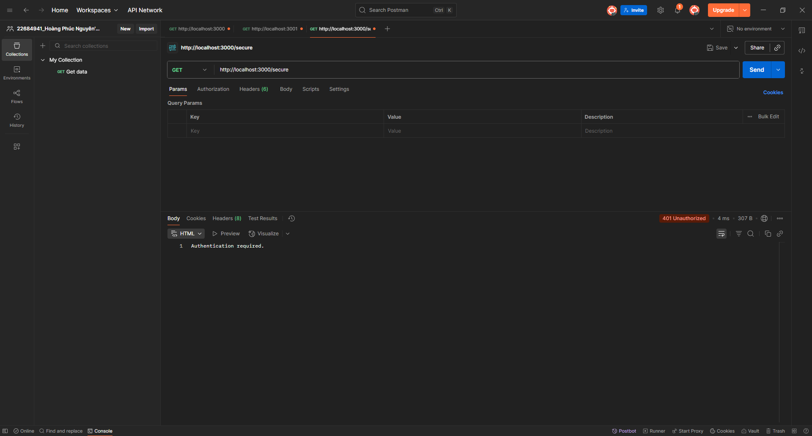

Simple Auth
Giới thiệu

Dự án này demo cơ chế xác thực cơ bản (Basic Authentication và Cookie Authentication).

Cách chạy

Cài dependency: npm install

Chạy:
node basic_auth.js
node cookie_auth.js

Hướng dẫn test

Với basic_auth.js: gọi API bằng Postman với header Authorization: Basic <base64(username:password)>

Với cookie_auth.js: đăng nhập → nhận cookie → kiểm tra trong Postman và MongoDB.

Kết quả test
### 1. Auth Require

### 2. Login

### 3. Header Authorization

### 4. Cookie

### 5. Cookie in mongoDB
